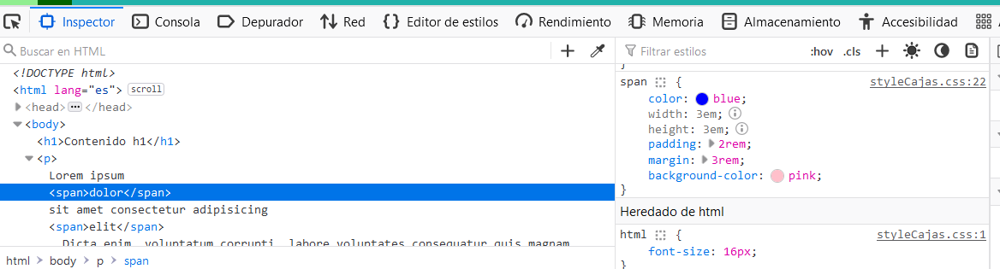
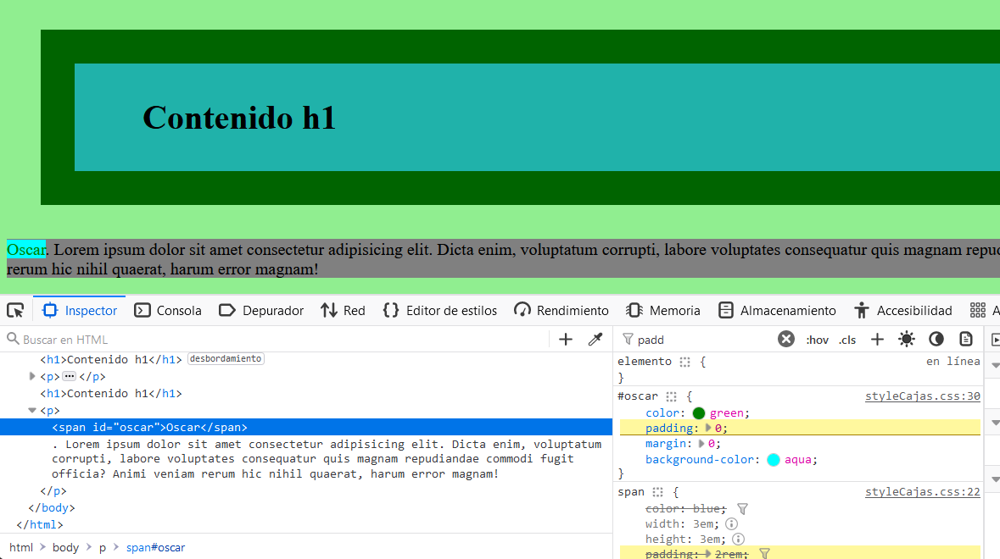

___
En esta imagen encontramos que en elemento span, no se aplican las propiedades width y height, ya que al ser un elemento inline no se aplican estas propiedades.
___

___
En estas dos capturas de pantalla a través de la barra de búsqueda que nos proporciona el navegador al inspeccionar la página podemos encontrar las propiedades de margin y padding, las cuales realizan la función de aplicar un espacio en blanco alrededor del contenido del bloque al que se le está aplicando.
___

___
En la imagen podemos encontrar que se ha añadido mi nombre, Oscar, con las propiedades adecuadas para que no tuviese ningún margen alrededor del contenido.