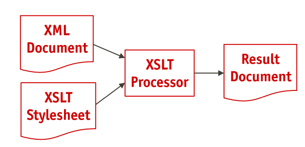
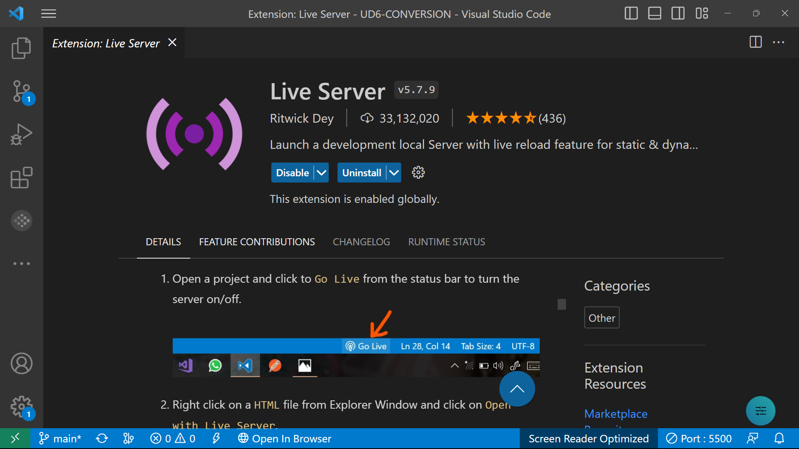

# UD6 A3 Conversiones. XSLT

## XSLT 

Stylesheets Transformation. 
XSLT se fija en la transformación de documentos XML. El proceso es el siguiente:

## Proceso de transformación

El proceso de transformación puede llevarse a cabo de distintas formas:

1. En el servidor Web
2. En el cliente Web
3. En una aplicación de escritorio

### Transformación desde el servidor. Extensión Live server en Visual Studio Code

Nosotros vamos a utilizar la extensión Live Server en Visual Studio Code. Es una herramienta que permite lanzar un servidor de desarrollo local para previsualizar en el navegador lo que estamos escribiendo en nuestro editor de código.

Una vez instalada la extensión, abre el fichero .xml con el .xsl asociado desde la barra del editor. Si todo está correcto el fichero se muestra transformado.

## Ejemplos
Abre  desde la extensión Live server en Visual Studio Code los ejemplos que se adjuntan en este repositorio. Usa el navegador Opera. 

Envía los pantallazos que lo demuestre. Para ello introduce la etiqueta title con tu nombre y apellidos.

Responde a las siguientes preguntas:
1. Son 6 ficheros xml que se transforman. Indica cuáles de ellos se transforman en fichero html.

   Todos menos el primero
2. La transformación se realiza asociándolos a una hoja de estilo distinta. Indica cómo se vincula cada fichero .xml a su hoja de transformación
   ~~~
   <?xml-stylesheet type="text/xsl" href="A8Transformacion.xsl"?>
   ~~~
   De esta forma enlazamos el documento xml al documento xsl
   
3. De las hojas de estilo indica cuántas son ficheros .xml bien formados.
   
   Todos menos el primero que es css
4. Indica el elemento raíz de un fichero hoja de estilo .xsl
   ~~~
    <xsl:stylesheet xmlns:xsl="http://www.w3.org/1999/XSL/Transform" version="2.0">
   ~~~
5. Busca la etiqueta output y analízala
~~~
<xsl:output encoding="utf-8" omit-xml-declaration="yes" method="html" indent="yes" />
~~~
1. Encuentra la etiqueta "xsl:template". Analiza en qué parte del documento aparece y con qué contexto
   
   La etiqueta "xsl:template" aparece en la tercera línea indicando el "match" para la ruta que seleccionamos que puede ser la raíz o una ruta relativa para despúes ir indicando la selección de los datos.
2. Indica un listado de las etiquetas xsl: que aparecen en los documentos .xsl e intenta explicar su uso
   
**xsl:stylesheet**:
Esta etiqueta define la hoja de estilo XSLT. Contiene atributos para especificar la versión de XSLT que se está utilizando, así como otros detalles como el espacio de nombres. Dentro de esta etiqueta, se colocan las reglas de transformación.

**xsl:template**: Esta etiqueta define un patrón de coincidencia para un elemento en el documento XML de origen. Contiene instrucciones XSLT para cómo transformar el elemento coincidente y sus descendientes.

**xsl:value-of**: Esta etiqueta se utiliza para recuperar y mostrar el valor de un nodo XML en el resultado transformado. Se utiliza dentro de los elementos xsl:template para insertar contenido dinámicamente en el documento de salida.

**xsl:apply-templates**: Esta etiqueta se utiliza para invocar la aplicación de otras plantillas. Se utiliza dentro de los elementos xsl:template para procesar subárboles de elementos XML.

**xsl:for-each**: Esta etiqueta se utiliza para iterar sobre un conjunto de nodos XML y aplicar un conjunto de instrucciones XSLT a cada nodo en ese conjunto.

**xsl:if** y **xsl:choose**: Estas etiquetas se utilizan para controlar el flujo de ejecución en una transformación XSLT. xsl:if se utiliza para evaluar una condición y ejecutar un bloque de código si esa condición es verdadera. xsl:choose se utiliza para proporcionar una estructura de control de selección similar a un switch o case en otros lenguajes de programación.

**xsl:attribute**: Esta etiqueta se utiliza para crear atributos en los elementos del resultado transformado. Permite agregar atributos a elementos específicos durante la transformación

**xsl:comment**: Esta etiqueta se utiliza para insertar comentarios en el resultado transformado. Los comentarios pueden ser útiles para proporcionar información adicional o para fines de depuración en el documento de salida.

8. Crea y entrega una plantilla de fichero .xsl 
   
   [XML](A8xml.xml)
   
   [XSL](A8Transofrmacion.xsl)

De interés
- [XSLT en mclibre](https://www.mclibre.org/consultar/xml/otros/clase.html)
- [XPATH en mclibre](https://www.mclibre.org/consultar/xml/lecciones/xml-xpath.html) 
- [XSLT Transformation Online Tool](https://www.online-toolz.com/tools/xslt-transformation.php)
- [www.freeformatter.com. XSL Transformer - XSLT](https://www.freeformatter.com/xsl-transformer.html)
- [Ejemplo de transformación con hoja de estilos XSL. José Luis Cruz](https://youtu.be/fGtlVYgppOM)
- [XSL. María Jesús Lamarca Lapuente](http://www.hipertexto.info/documentos/xsl.htm)
- [XPath y BaseX (II). Universidad.xml](https://youtu.be/WL6IfVvL0kc)
- [Tareas 1º DAM/DAW e-learning - Tarea 5 - Lenguaje de marcas #7 - Datos primer empleado (parte 1)](https://youtu.be/HRPnntyVZ0w)
- [Tareas 1º DAM/DAW e-learning - Tarea 5 - Lenguaje de marcas #11 - Mostrando artistas en xsl](https://youtu.be/9PQTcbFmSmQ)
