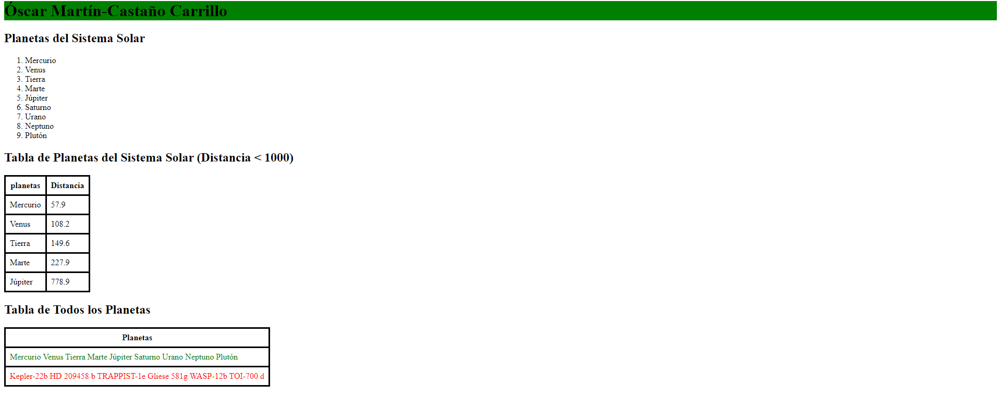

# UD6 A5. Conversiones. Tu propia transformación

Localiza o genera tu propio xml para transformarlo con las siguientes características:
- El formato de salida será HTML
    - El título contendrá tu nombre y primer apellido
    - Usa la etiqueta style dentro de head para aplicar las reglas CSS
        - Cambia la letra
        - Cambia algún color de fondo
        - Aplica borde a las tablas
- Transforma en una lista ordenada por un dato numérico. Un mínimo de 5 elementos
- Transforma en una tabla (mínimo de 5 elementos) donde filtres de esta forma:
```console
<xsl:apply-templates select="/bib/libro[precio&lt;100]/titulo">
````
- Transforma en otra tabla (mínimo de 5 elementos) donde uses la etiqueta choose para cambiar un color en algunas de sus celdas. Ejemplo:
```console
<xsl:choose>
    <xsl:when test="año>2000">
        <td style="color: green"><xsl:value-of select="titulo"/></td>
    </xsl:when>
    <xsl:otherwise>
        <td style="color: red"><xsl:value-of select="titulo"/></td>
    </xsl:otherwise>
</xsl:choose>
```
- Usa la etiqueta ``<xsl:for-each>`` [For-each](https://github.com/iesgrancapitan-llmm/ud6-a5-conversiones-tu-propia-transformacion-oscarmcc-2/blob/121c741dd471dcd571ec37feca9f5facee3f3be9/planetas.xsl#L49)
- Usa la etiqueta ``<xsl:attribute>`` [Attribute](https://github.com/iesgrancapitan-llmm/ud6-a5-conversiones-tu-propia-transformacion-oscarmcc-2/blob/121c741dd471dcd571ec37feca9f5facee3f3be9/planetas.xsl#L78)
- Usa la etiqueta ``<xsl:variable>`` [Variable](https://github.com/iesgrancapitan-llmm/ud6-a5-conversiones-tu-propia-transformacion-oscarmcc-2/blob/121c741dd471dcd571ec37feca9f5facee3f3be9/planetas.xsl#L66)
- Haz uso de al menos dos funciones en el XPath
- Haz uso de más de una template para el mismo elemento
- Envía un pantallazo de la transformación resultante
  
  

- Envía el documento ``.html`` resultante
  
  [HTML resultante](resultado.html)

- Documenta cada apartado anterior con un enlace al fichero ``.xsl``

[XML](planetas.xml)

[XSL](planetas.xsl)

                            

